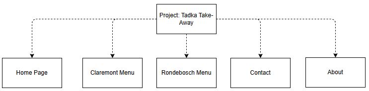

# Tadka Take Aways Website

## Student Info

Name: Ivan Copeland
Student Number: ST10486281
Course Code: HMAW0501

## Project Overview

This project aim to deliver a responsive website for take-away chain Tadka. It aims to showcase menus and outlet details, provide a booking link supported by dineplan.com and strengthen Tadka's brand identity. This project will be built using HTML, CSS and Javascript.

## Goals and Objectives

### Company Overview

Tadka is an India takeaway food chain that specialises in delicious takeaway and sitdown options. They have 2 outlets 1 in Claremont and the other in Rondebosch.

### Goals

Tadka is an Indian takeaway food chain that has outlets in multiple locations in Cape Town. They need a website to communicate their food and drink options for customers who want to place an order. They also need the ability to make booking. Since they have different outlets that each may have slightly different menu options they need to be able to show that. They also want to give a sense of what their existing customers think of them to attract new customers.

## Key Website Features and Functionality

1.  Clear Purpose
    1.  Make clear simple description about company and niche on homepage
2.  Services
    1.  Provide services/product list with categories easy to read for each outlet (separate page for each menu)
3.  Easy to Read
    1.  Use informative and attractive images
    2.  Make content readable with enough padding and no overlapping
4.  Memorable Branding [(August 22 et al., 2019)](https://planable.io/blog/brand-guide-font-colors/)
    1.  Use unique and attractive branding colors, logos and fonts
5.  Responsive
    1.  Make website mobile responsive
6.  Navigation
    1.  Make functional error free navigation menu
7.  Engagement
    1.  Provide booking form (seperate page)/link 
8.  Contact
    1.  Provide contact form and or contact details

[(A.npn, 2024)](https://www.linkedin.com/pulse/how-align-your-business-goals-website-steve-bambury-ff8tc/)

[(tamami.I Web Developer, 2024)](https://supino0017.medium.com/technology-selection-to-stay-aligned-with-business-goals-6dcd3281813a)

## Design Aesthetic

### Memorable branding

#### Fonts

*   Headings: Sans-serif, bold and modern
*   Body text: Sans-serif, clean and regular weight

[(Aeolidia.com, 2025)](https://aeolidia.com/choosing-fonts-and-colors-for-your-brand/)

#### Colors

*   Heading text color: White or light grey
*   Primary background color: Charcoal, black, or very dark navy
*   Secondary background blocks/cards: Deep muted tones (e.g. dark plum, slate, forest green)
*   Body text color: Soft grey (not pure white to reduce eye strain)
*   Special/eye-catching color: Bright hue like electric blue, neon coral, or acid green

[(Captivation Agency, 2022)](https://captivation.agency/insights/experience-design-how-colors-shapes-and-fonts-impact-and-affect-your-branding.html)

### Readable spacing

*   Padding: Medium (at least 12–16px around content)
*   Avoid overlapping: One section per block, clean margins

## Technical Requirements

*   Domain Name: [tadka.co.za](http://tadka.co.za) 
*   Languages: HTML, CSS, JavaScript
*   CSS Framework: Bootstrap
*   Other Tools: 

*   Google Forms (for simple contact)
*   Dineplan (for bookings)

## Timeline

This timeline assumes a flexible part-time pace, where each working day includes approximately 5 hours of focused work (common in creative, student, or freelance projects). All time estimates below are based on this ratio:

<table>
   <tbody>
      <tr>
         <td>
            
<strong>Milestone</strong>

         </td>
         <td>
            
<strong>Est. Days</strong>

         </td>
         <td>
            
<strong>Total Hours</strong>

         </td>
         <td>
            
<strong>Description</strong>

         </td>
      </tr>
      <tr>
         <td>
            
Research &ndash; Strategy &amp; Requirements

         </td>
         <td>
            
2.5 days

         </td>
         <td>
            
12 hrs

         </td>
         <td>
            
Define goals, user needs, content/function specs

         </td>
      </tr>
      <tr>
         <td>
            
Design &ndash; Structure &amp; Flow

         </td>
         <td>
            
1.5 days

         </td>
         <td>
            
8 hrs

         </td>
         <td>
            
Journey maps, info structure, flow diagrams

         </td>
      </tr>
      <tr>
         <td>
            
Design &ndash; Wireframes

         </td>
         <td>
            
2 days

         </td>
         <td>
            
10 hrs

         </td>
         <td>
            
Rough stretches

         </td>
      </tr>
      <tr>
         <td>
            
Design &ndash; Stylized Mockups

         </td>
         <td>
            
2.5 days

         </td>
         <td>
            
12 hrs

         </td>
         <td>
            
Colors, branding, polished layouts

         </td>
      </tr>
      <tr>
         <td>
            
Development &ndash; Core Build

         </td>
         <td>
            
3 days

         </td>
         <td>
            
16 hrs

         </td>
         <td>
            
HTML, CSS (Bootstrap), JS, page linking

         </td>
      </tr>
      <tr>
         <td>
            
Development &ndash; Responsivity

         </td>
         <td>
            
1.5 days

         </td>
         <td>
            
8 hrs

         </td>
         <td>
            
Mobile-first tuning &amp; testing

         </td>
      </tr>
      <tr>
         <td>
            
Feedback &amp; Iteration

         </td>
         <td>
            
1.5 days

         </td>
         <td>
            
8 hrs

         </td>
         <td>
            
Revisions based on review

         </td>
      </tr>
      <tr>
         <td>
            
Total

         </td>
         <td>
            
12 days

         </td>
         <td>
            
~62 hrs

         </td>
         <td>
            
Spread over ~2.5 work weeks (at 5 hrs/day)

         </td>
      </tr>
   </tbody>
</table>

[(Mary, 2023)](https://www.markup.io/blog/website-timeline/)

[(Atlassian, 2025)](https://www.atlassian.com/work-management/project-management/project-planning/timeline)

## Budget
<table>
         <tbody>
            <tr>
               <td>
                  
<strong>Item</strong>

               </td>
               <td>
                  
<strong>Rate (ZAR/hr)</strong>

               </td>
               <td>
                  
<strong>Hours</strong>

               </td>
               <td>
                  
<strong>Subtotal (ZAR)</strong>

               </td>
               <td>
                  
<strong>Notes</strong>

               </td>
            </tr>
            <tr>
               <td>
                  
UX Research &amp; Design

               </td>
               <td>
                  
R250/hr

               </td>
               <td>
                  
30 hrs

               </td>
               <td>
                  
R7,500

               </td>
               <td>
                  
Strategy, flow, wireframes, visual UI

               </td>
            </tr>
            <tr>
               <td>
                  
Development

               </td>
               <td>
                  
R250/hr

               </td>
               <td>
                  
32 hrs

               </td>
               <td>
                  
R8,000

               </td>
               <td>
                  
HTML/CSS (Bootstrap), responsiveness

               </td>
            </tr>
            <tr>
               <td>
                  
Domain &amp; Hosting

               </td>
               <td>
                  
-

               </td>
               <td>
                  
-

               </td>
               <td>
                  
R250

               </td>
               <td>
                  
.com domain, Netlify/Vercel free tier

               </td>
            </tr>
            <tr>
               <td>
                  
Tools (Google Forms, Fonts)

               </td>
               <td>
                  
-

               </td>
               <td>
                  
-

               </td>
               <td>
                  
R0

               </td>
               <td>
                  
Public/free tools

               </td>
            </tr>
            <tr>
               <td>
                  
One-time Total

               </td>
               <td>
                  
-

               </td>
               <td>
                  
62 hrs

               </td>
               <td>
                  
R20,350

               </td>
               <td>
                  
Spread over ~2.5 weeks (part-time pacing)

               </td>
            </tr>
         </tbody>
      </table>

[(OneNine, 2025)](https://onenine.com/website-project-plan-template)

## Sitemap

## Changelog

- 2025-08-25: Added Readme

## References

1.  A.npn, S.B. (2024). Your website is more than just an online brochure. It’s the cornerstone of your brand and the primary platform for engaging with potential customers. [online] Linkedin.com. Available at: [https://www.linkedin.com/pulse/how-align-your-business-goals-website-steve-bambury-ff8tc](https://www.linkedin.com/pulse/how-align-your-business-goals-website-steve-bambury-ff8tc)   [Accessed 19 Aug. 2025].
2.  Aeolidia.com. (2025). Blocked. [online] Available at: [https://aeolidia.com/choosing-fonts-and-colors-for-your-brand](https://aeolidia.com/choosing-fonts-and-colors-for-your-brand) /  [Accessed 19 Aug. 2025]
3.  Atlassian (2025). Project management timeline | The Workstream. [online] Atlassian. Available at: [https://www.atlassian.com/work-management/project-management/project-planning/timeline](https://www.atlassian.com/work-management/project-management/project-planning/timeline) 
4.  August 22, R.M., February 4th, 2019, up, 2021 S. and Free →, I. (2019). Building a Brand Guide: Choosing Fonts and Colors. [online] Planable. Available at: [https://planable.io/blog/brand-guide-font-colors](https://planable.io/blog/brand-guide-font-colors) / .
5.  Bose, S. (2023). 7 Core Elements for a Modern Web Design. [online] BrowserStack. Available at: [https://www.browserstack.com/guide/elements-of-modern-web-design](https://www.browserstack.com/guide/elements-of-modern-web-design)  .
6.  Captivation Agency. (2022). User Experience Design: How Colors, Shapes, And Fonts Impact And Affect Your Branding · Video Production & Web Design/Development Agency | Captivation Agency | Sarasota, FL. [online] Available at: [https://captivation.agency/insights/experience-design-how-colors-shapes-and-fonts-impact-and-affect-your-branding.html](https://captivation.agency/insights/experience-design-how-colors-shapes-and-fonts-impact-and-affect-your-branding.html)  .
7.  Mary (2023). What’s a website timeline? How to build one (w/ free template) - Markup.io. [online] Markup.io. Available at: [https://www.markup.io/blog/website-timeline/](https://www.markup.io/blog/website-timeline/)   [Accessed 19 Aug. 2025].
8.  OneNine. (2025). Website Project Plan Template: Your Ultimate Guide - OneNine. [online] Available at: [https://onenine.com/website-project-plan-template](https://onenine.com/website-project-plan-template)   [Accessed 19 Aug. 2025].
9.  Sharma, V. (2025). 10 Elements of Web Design You Need to Know in 2025. [online] Bluehost Blog. Available at: [https://www.bluehost.com/blog/website-elements](https://www.bluehost.com/blog/website-elements)   [Accessed 19 Aug. 2025].
10.  Warner, R. (2022). Call to Action Examples for Modern Web Design - Connective. [online] Connective Web Design. Available at: [https://connectivewebdesign.com/blog/call-to-action-samples](https://connectivewebdesign.com/blog/call-to-action-samples) .
11.  tamami.I Web Developer (2024). Technology Selection to Stay Aligned with Business Goals. [online] Medium. Available at: [https://supino0017.medium.com/technology-selection-to-stay-aligned-with-business-goals-6dcd3281813a](https://supino0017.medium.com/technology-selection-to-stay-aligned-with-business-goals-6dcd3281813a)  .