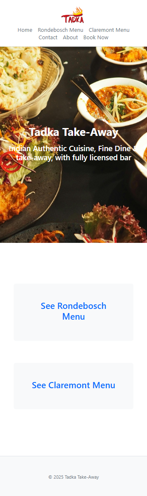
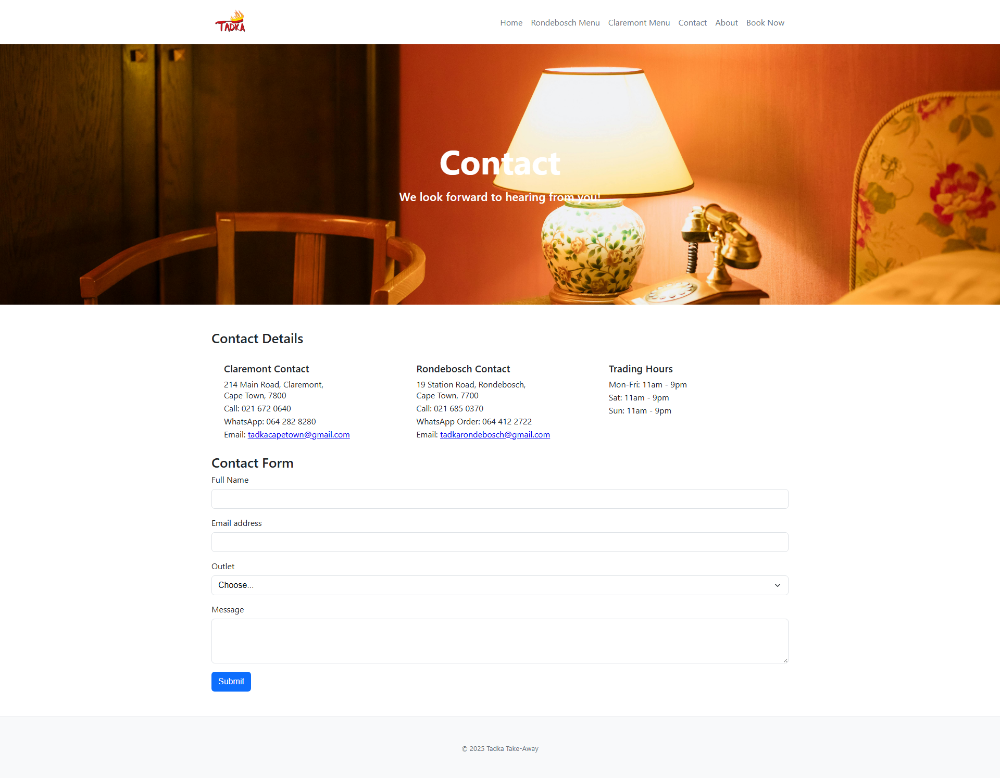

# Tadka Take Aways Website

## Student Info

- Name: Ivan Copeland
- Student Number: ST10486281
- Course Code: HMAW0501

## Project Overview

This project aim to deliver a responsive website for take-away chain Tadka. It aims to showcase menus and outlet details, provide a booking link supported by dineplan.com and strengthen Tadka's brand identity. This project will be built using HTML, CSS and Javascript.

## Goals and Objectives

### Company Overview

Tadka is an India takeaway food chain that specialises in delicious takeaway and sitdown options. They have 2 outlets 1 in Claremont and the other in Rondebosch. Their goal is to provide quality and authentic Indian food to customers. Their target audience is customers in Claremont, Rondebosch and surrounds. Their history is that they have been doing well as a business since they started in 2020 but think it's time to step it up a notch.

### Goals

They need a website to communicate their food and drink options for their target market who are hungry customers who want to place an order in and around Claremont and Rondebosch. They also need the ability to make booking. Since they have different outlets that each may have slightly different menu options they need to be able to show that. 

Their overarching goals in creating this website are to strengthen their brand identity and increase bookings and customer traction at their outlets. KPIs for this project are the increase in the number of bookings obtained through dineplan.

## Key Website Features and Functionality

1.  Clear Purpose
    1.  Make clear simple description about company and niche on homepage
2.  Services
    1.  Provide services/product list with categories easy to read for each outlet (separate page for each menu)
3.  Easy to Read
    1.  Use informative and attractive images
    2.  Make content readable with enough padding and no overlapping
4.  Memorable Branding [(August 22 et al., 2019)](https://planable.io/blog/brand-guide-font-colors/)
    1.  Use unique and attractive branding colors, logos and fonts
5.  Responsive
    1.  Make website mobile responsive
6.  Navigation
    1.  Make functional error free navigation menu
7.  Engagement
    1.  Provide booking form (seperate page)/link 
8.  Contact
    1.  Provide contact form and or contact details

[(A.npn, 2024)](https://www.linkedin.com/pulse/how-align-your-business-goals-website-steve-bambury-ff8tc/)

## Design Aesthetic

### Memorable branding

#### Fonts

*   Headings: Sans-serif, bold and modern
*   Body text: Sans-serif, clean and regular weight

[(Aeolidia.com, 2025)](https://aeolidia.com/choosing-fonts-and-colors-for-your-brand/)

#### Colors

*   Heading text color: White or light grey
*   Primary background color: Charcoal, black, or very dark navy
*   Secondary background blocks/cards: Deep muted tones (e.g. dark plum, slate, forest green)
*   Body text color: Soft grey (not pure white to reduce eye strain)
*   Special/eye-catching color: Bright hue like electric blue, neon coral, or acid green

[(Captivation Agency, 2022)](https://captivation.agency/insights/experience-design-how-colors-shapes-and-fonts-impact-and-affect-your-branding.html)

### Readable spacing

*   Padding: Medium (at least 12–16px around content)
*   Avoid overlapping: One section per block, clean margins

## Technical Requirements

*   Domain Name: [tadka.co.za](http://tadka.co.za) 
*   Languages: HTML, CSS, JavaScript
*   CSS Framework: Bootstrap
*   Other Tools: 

*   Google Forms (for simple contact)
*   Dineplan (for bookings)

## Timeline

This timeline assumes a flexible part-time pace, where each working day includes approximately 5 hours of focused work (common in creative, student, or freelance projects). All time estimates below are based on this ratio:

<table>
   <tbody>
      <tr>
         <td>
            
<strong>Milestone</strong>

         </td>
         <td>
            
<strong>Est. Days</strong>

         </td>
         <td>
            
<strong>Total Hours</strong>

         </td>
         <td>
            
<strong>Description</strong>

         </td>
      </tr>
      <tr>
         <td>
            
Research &ndash; Strategy &amp; Requirements

         </td>
         <td>
            
2.5 days

         </td>
         <td>
            
12 hrs

         </td>
         <td>
            
Define goals, user needs, content/function specs

         </td>
      </tr>
      <tr>
         <td>
            
Design &ndash; Structure &amp; Flow

         </td>
         <td>
            
1.5 days

         </td>
         <td>
            
8 hrs

         </td>
         <td>
            
Journey maps, info structure, flow diagrams

         </td>
      </tr>
      <tr>
         <td>
            
Design &ndash; Wireframes

         </td>
         <td>
            
2 days

         </td>
         <td>
            
10 hrs

         </td>
         <td>
            
Rough stretches

         </td>
      </tr>
      <tr>
         <td>
            
Design &ndash; Stylized Mockups

         </td>
         <td>
            
2.5 days

         </td>
         <td>
            
12 hrs

         </td>
         <td>
            
Colors, branding, polished layouts

         </td>
      </tr>
      <tr>
         <td>
            
Development &ndash; Core Build

         </td>
         <td>
            
3 days

         </td>
         <td>
            
16 hrs

         </td>
         <td>
            
HTML, CSS (Bootstrap), JS, page linking

         </td>
      </tr>
      <tr>
         <td>
            
Development &ndash; Responsivity

         </td>
         <td>
            
1.5 days

         </td>
         <td>
            
8 hrs

         </td>
         <td>
            
Mobile-first tuning &amp; testing

         </td>
      </tr>
      <tr>
         <td>
            
Feedback &amp; Iteration

         </td>
         <td>
            
1.5 days

         </td>
         <td>
            
8 hrs

         </td>
         <td>
            
Revisions based on review

         </td>
      </tr>
      <tr>
         <td>
            
Total

         </td>
         <td>
            
12 days

         </td>
         <td>
            
~62 hrs

         </td>
         <td>
            
Spread over ~2.5 work weeks (at 5 hrs/day)

         </td>
      </tr>
   </tbody>
</table>

[(Mary, 2023)](https://www.markup.io/blog/website-timeline/)

## Budget
<table>
         <tbody>
            <tr>
               <td>
                  
<strong>Item</strong>

               </td>
               <td>
                  
<strong>Rate (ZAR/hr)</strong>

               </td>
               <td>
                  
<strong>Hours</strong>

               </td>
               <td>
                  
<strong>Subtotal (ZAR)</strong>

               </td>
               <td>
                  
<strong>Notes</strong>

               </td>
            </tr>
            <tr>
               <td>
                  
UX Research &amp; Design

               </td>
               <td>
                  
R250/hr

               </td>
               <td>
                  
30 hrs

               </td>
               <td>
                  
R7,500

               </td>
               <td>
                  
Strategy, flow, wireframes, visual UI

               </td>
            </tr>
            <tr>
               <td>
                  
Development

               </td>
               <td>
                  
R250/hr

               </td>
               <td>
                  
32 hrs

               </td>
               <td>
                  
R8,000

               </td>
               <td>
                  
HTML/CSS (Bootstrap), responsiveness

               </td>
            </tr>
            <tr>
               <td>
                  
Domain &amp; Hosting

               </td>
               <td>
                  
-

               </td>
               <td>
                  
-

               </td>
               <td>
                  
R250

               </td>
               <td>
                  
.com domain, Netlify/Vercel free tier

               </td>
            </tr>
            <tr>
               <td>
                  
Tools (Google Forms, Fonts)

               </td>
               <td>
                  
-

               </td>
               <td>
                  
-

               </td>
               <td>
                  
R0

               </td>
               <td>
                  
Public/free tools

               </td>
            </tr>
            <tr>
               <td>
                  
One-time Total

               </td>
               <td>
                  
-

               </td>
               <td>
                  
62 hrs

               </td>
               <td>
                  
R20,350

               </td>
               <td>
                  
Spread over ~2.5 weeks (part-time pacing)

               </td>
            </tr>
         </tbody>
      </table>

[(OneNine, 2025)](https://onenine.com/website-project-plan-template)

## Sitemap

## Content Research and Sourcing

Please see content in the "Content Research and Sourcing.zip". And see below for each content items details

*   Images

      *   All banner images - (Pexels, 2017a; Pexels, 2017b; Pexels, 2018a; Pexels, 2018b;)
      *   Popular dish images - (Tadka.co.za, 2021a;  Tadka.co.za, 2021b;  Tadka.co.za, 2021c;  Tadka.co.za, 2021d; )
      *   Logo  - (Tadka.co.za, 2025)

*   Code

      *   HTML template code snippet - (Example.com, 2019)

*   Text

      *   About page info - (Snowdon, 2024)
      *   Menu text info  - (Tadka.co.za, 2021f;  Tadka.co.za, 2021g )

## Changelog

### Part 1

- 2025/08/25 – Start repo with readme.md
- 2025/08/25 – Added home, rondebosch and claremont pages
- 2025/08/26 – Create about and contact pages
- 2025/08/26 – Reroganized folder and added research content folder
- 2025/08/26 - Added hero images and improved file paths
- 2025/08/26 – Populated menu item sections
- 2025/08/27 – Added comments
- 2025/08/27 – Added js and css folders

### Part 2

- 2025/09/23 – Initial format of home page code
- 2025/09/24 – Created stylesheet with tonnes of functionality off the shelf
- 2025/09/24 – Applied useful classes to style all pages in the realms of typography, layout and decoration
- 2025/09/24 – Made some layout imporvements and added dot seperators in menu sections
- 2025/09/24 – Made main nav responsive
- 2025/09/25 – Made image loading responsive
- 2025/09/25 – Made font base size responsive
- 2025/09/25 – Addressed content research feedback to by improving about us page content 
- 2025/09/25 – Address sitemap feedback by adding external link block

### Part 3

- 2025/11/15 - Fixed contact form formatting 
- 2025/11/15 - Addressed feedback by improving accessibility
- 2025/11/15 - Added map modals making the page interactive
- 2025/11/15 - Added dynamic HTML sorting and filtering to both menu pages
- 2025/11/15 - Added robots.txt and sitemap.xml for SEO
- 2025/11/15 - Added meta description tags and keyword-filled content
- 2025/11/15 - Added location-based SEO enhancements
- 2025/11/15 - Added anti-spam verification (fake reCAPTCHA) 
- 2025/11/18 - Added enquiry form with AJAX, validation, and reason-for-contact dropdown
- 2025/11/18 - Updated changelog, added speed considerations and off-page seo measure to readme
- 2025/11/19 - Moved enquiry to it's own page

## Speed Considerations

Since there is no CMS used and all content is statically hardcoded there is no data caching needed for optimization. However images have been optimized for the web by using good images compressions formats.

## Off-Page SEO Inititiatives

### Backlinks

Measure we can put in place for increasing our backlinks are:
- Encouraging partners to link our website in their sites
- Reaching out to local relevant blogs to write about us and link our site in the articles.
- Adding our business to google maps
- Adding our business to relevant local directory sites including our website link in the listings.

### Social Media

Post and campaigns we can make on social media include:
- Include our site link in all our social media bios (facebook/instragram)
- Make regular posts showcasing additions to our menu etc
- Create incentive for customers to tag us in their relevant social media posts if they make posts about events that maybe used our catering etc
- When we make posts we must include relevant and location based hashtags to encourage natural relevant views

## Screenshots

### Home

#### Desktop

#### Tablet

#### Mobile

### Contact

#### Desktop

#### Tablet

#### Mobile

## References

- A.npn, S.B. (2024). Your website is more than just an online brochure. It’s the cornerstone of your brand and the primary platform for engaging with potential customers. [online] Linkedin.com. Available at: [https://www.linkedin.com/pulse/how-align-your-business-goals-website-steve-bambury-ff8tc](https://www.linkedin.com/pulse/how-align-your-business-goals-website-steve-bambury-ff8tc)   [Accessed 19 Aug. 2025].
- Aeolidia.com. (2025). Blocked. [online] Available at: [https://aeolidia.com/choosing-fonts-and-colors-for-your-brand](https://aeolidia.com/choosing-fonts-and-colors-for-your-brand) /  [Accessed 19 Aug. 2025]
- August 22, R.M., February 4th, 2019, up, 2021 S. and Free →, I. (2019). Building a Brand Guide: Choosing Fonts and Colors. [online] Planable. Available at: [https://planable.io/blog/brand-guide-font-colors](https://planable.io/blog/brand-guide-font-colors) / .
- Bootstrap (2025). Bootstrap. [online] Getbootstrap.com. Available at: https://getbootstrap.com/.
- Bose, S. (2023). 7 Core Elements for a Modern Web Design. [online] BrowserStack. Available at: [https://www.browserstack.com/guide/elements-of-modern-web-design](https://www.browserstack.com/guide/elements-of-modern-web-design)  .
- Captivation Agency. (2022). User Experience Design: How Colors, Shapes, And Fonts Impact And Affect Your Branding · Video Production & Web Design/Development Agency | Captivation Agency | Sarasota, FL. [online] Available at: [https://captivation.agency/insights/experience-design-how-colors-shapes-and-fonts-impact-and-affect-your-branding.html](https://captivation.agency/insights/experience-design-how-colors-shapes-and-fonts-impact-and-affect-your-branding.html)  .
- danhere (2010). Adding a dotted line trail after menu description. [online] Stack Overflow. Available at: https://stackoverflow.com/questions/2360830/adding-a-dotted-line-trail-after-menu-description.
- example.com. (n.d.). Example Domain. [online] Available at: [http://example.com/](http://example.com/) .
- Mary (2023). What’s a website timeline? How to build one (w/ free template) - Markup.io. [online] Markup.io. Available at: [https://www.markup.io/blog/website-timeline/](https://www.markup.io/blog/website-timeline/)   [Accessed 19 Aug. 2025].
- morbusg (2010). H1-H6 font sizes in HTML. [online] Stack Overflow. Available at: https://stackoverflow.com/questions/2325850/h1-h6-font-sizes-in-html/79773013#79773013.
- OneNine. (2025). Website Project Plan Template: Your Ultimate Guide - OneNine. [online] Available at: [https://onenine.com/website-project-plan-template](https://onenine.com/website-project-plan-template)   [Accessed 19 Aug. 2025].
- Pexels.com. (2017a). Available at: [https://www.pexels.com/photo/close-up-of-menu-313700/](https://www.pexels.com/photo/close-up-of-menu-313700/)  [Accessed 27 Aug. 2025].
- Pexels.com. (2017b). Available at: [https://www.pexels.com/photo/white-receipt-on-table-612790/](https://www.pexels.com/photo/white-receipt-on-table-612790/)  [Accessed 27 Aug. 2025].
- Pexels.com. (2018a). Available at: [https://www.pexels.com/photo/platter-of-foods-941869/](https://www.pexels.com/photo/platter-of-foods-941869/)  [Accessed 27 Aug. 2025].
- Pexels.com. (2018b). White and Brown Cooked Dish on White Ceramic Bowls · Free Stock Photo. [online] Pexels. Available at: [https://www.pexels.com/photo/white-and-brown-cooked-dish-on-white-ceramic-bowls-958545/](https://www.pexels.com/photo/white-and-brown-cooked-dish-on-white-ceramic-bowls-958545/) .
- Pexels.com. (2021). Available at: [https://www.pexels.com/photo/vintage-telephone-beside-the-bed-7609139/](https://www.pexels.com/photo/vintage-telephone-beside-the-bed-7609139/)  [Accessed 27 Aug. 2025].
- Snowdon, F. (2024). A Beginner’s Guide to North Indian Food: What Makes It Unique | Raj’s Corner. [online] Raj’s Corner. Available at: [https://rajscorner.com.au/north-indian-food/](https://rajscorner.com.au/north-indian-food/) .
- Tadka.co.za. (2021a). Available at: [http://tadka.co.za/wp-content/uploads/2021/08/Untitled-design-2.png](http://tadka.co.za/wp-content/uploads/2021/08/Untitled-design-2.png)  [Accessed 27 Aug. 2025].
- Tadka.co.za. (2021b). Available at: [https://tadka.co.za/wp-content/uploads/2021/08/Untitled-design-1.png](https://tadka.co.za/wp-content/uploads/2021/08/Untitled-design-1.png)  [Accessed 27 Aug. 2025].
- Tadka.co.za. (2021c). Available at: [https://tadka.co.za/wp-content/uploads/2021/08/Untitled-design-3.png](https://tadka.co.za/wp-content/uploads/2021/08/Untitled-design-3.png)  [Accessed 27 Aug. 2025].
- Tadka.co.za. (2021d). Available at: [https://tadka.co.za/wp-content/uploads/2021/08/Untitled-design.png](https://tadka.co.za/wp-content/uploads/2021/08/Untitled-design.png)  [Accessed 27 Aug. 2025].
- Tadka.co.za. (2021e). Main Menu – Tadka. [online] Available at: [https://tadka.co.za/index.php/main-menu](https://tadka.co.za/index.php/main-menu)  [Accessed 27 Aug. 2025].
- Tadka.co.za. (2021f). Rondebosch Menu – Tadka. [online] Available at: [https://tadka.co.za/index.php/rondebosch-menu/](https://tadka.co.za/index.php/rondebosch-menu/)  [Accessed 27 Aug. 2025].
- Tadka.co.za. (2025). Available at: [https://tadka.co.za/wp-content/uploads/2021/08/Tadka\_Header1-1024x304.png](https://tadka.co.za/wp-content/uploads/2021/08/Tadka_Header1-1024x304.png)  [Accessed 27 Aug. 2025].
- W3schools.com. (2025). W3Schools online HTML editor. [online] Available at: https://www.w3schools.com/tags/tryit.asp?filename=tryhtml5_picture [Accessed 25 Sep. 2025].

## Disclaimer

I used the help of ChatGPT in the planning of this assignment, but writing and editing was my own academic effort.
